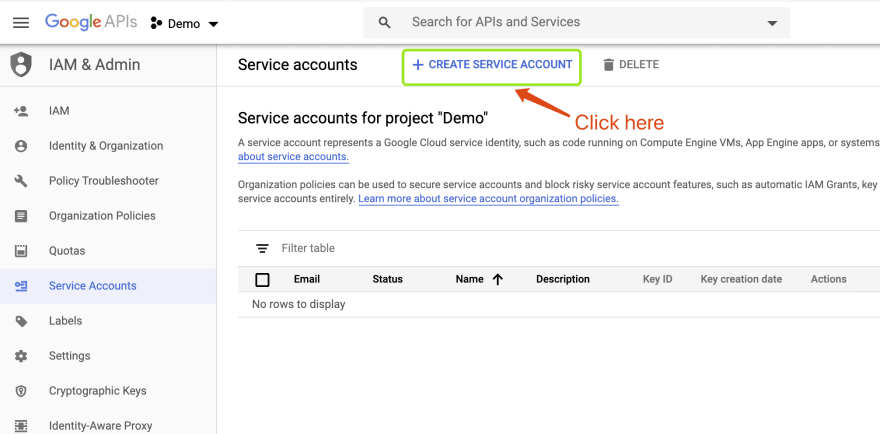
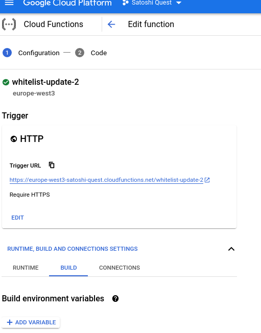

# Set up tutorial for the lambda function

Here are the detailed step-by-step instructions with screenshots:

## Spreadsheet

Go to Google's developer console:
https://console.developers.google.com/

Click on "Select a project" then click on "New project", give it a name.


Click on "Credentials" then click on "Manage service accounts", then click on "Create service account".




Add a name and description, then click "Create"


Click "Continue" on the "Service account permissions" page, as it is optional.

Click "Done" on "Grant users access to this service account" page, as it is also optional.

Click "Create key" under the Actions column.


Select the default "JSON" and Google will download a key file to your default download folder.


If you open the JSON file, there are two fields you'll need: "private_key" and "client_email"


Go to your Google Sheets and find the spreadsheet_id and sheet_id


 IMPORTANT Remember to share your spreadsheet with the email address in your key file with the key client_email


Upload sample spreadsheet from [sample whitelist file](https://docs.google.com/spreadsheets/d/1_oLcp4P8gROIrs38Y2rWYD4p1kLnl-rW/edit?usp=sharing&ouid=111607419147583303413&rtpof=true&sd=true)


## Lambda function

Select the previously created project


Go to Cloud Function marketplace and enable them for the project https://console.cloud.google.com/marketplace/product/google-cloud-platform/cloud-functions

Then click on "GO TO CLOUD FUNCTIONS"


Create a new function


Fill in the function data as in the picture below and click `SAVE`


```
# Example spreadsheet URL:
# https://docs.google.com/spreadsheets/d/16rHAH8woTm52nlI_d5tySrPHW12-nT98hUTjttHwEYg/edit#gid=0

# Use your own spreadsheet ID
SPREADSHEET_ID=16rHAH8woTm52nlI_d5tySrPHW12-nT98hUTjttHwEYg
SHEET_ID=0

# Use your service account email!
CLIENT_EMAIL=whitelist-manager@satoshi-quest.iam.gserviceaccount.com  # Google Cloud Service account

# Use your service account private key!
# NOTE: As you can see, the beginning of "----- BEGIN PRIVATE" and the end have
# been removed, leaving only the private key data.
PRIVATE_KEY='MIIEvQIBADANBgkqhkiG9w0BAQAFAASCBKcwggSjAgEAAoIBAQC2EQ4yfW6eQXcc 1aw3J4qzZvza6akPV9o1Tez12/d/Ei9pt30GfQxF3GGEnu3vqslfz2RqanGokaDm GcaOArjbSQ+fhsXzG7PX0aCukuBxujiuB+moVKDG3c4vBzraUcJAckxNt99SyPGl Jve1OAY66IkQyvqF6XX4OSKTpQ3mJ3rWG2NtlgbaKtpIgaDlawMfvmReQTsFNxz1 5JO5nANVVVPaeiaJNFJ+22cAtddhnw/BXLcn3d+NRuulpA0aDT4GK7ESZyYYSlXS iSVfe8gvP6QP9Nw5p9mIu16ZreqhK1K7665NtgKHRfENaZK/4CRlLTV1ch88Bpqf dpPik8jZAgMBAAECggEAAe2QTuyRHU/oKQACQNtEVr4Cc3cB+U2e2+2lUr0vk8Ln iaENy+HLHXpF9heQwXb3hvI1SAM0jOpt38KMxbg1qOzPI4tT0U07zE9F+lNH2Sx1 qTIgQU4UHcb/hfP3pZQ0EGaldDU8Qi4qkOsmuF6NglYwDWN4364nN6ezPAkFaqh/ y0RMHwm1jFDoUJ3FlAIOhkjPNS4LVSR2X47KCx6W2FPhX6ZOzs20c7fElR53a4HZ 6t9q4EO9eRU5CBbZVEtoKlhPw9Prt7+M3cUiIdQZ93GT1N2vp3WKua1I6K8R5I+u BtVmy7sVbAqllMSmgZaj4Ch/8zcNmBiXI2WB56UAGQKBgQDffO+fz8tnYiJXiJWi hAWGkgkkDIF7Z167K18Dzewf++t1Nl0VUJc7/aAPygToWt4HyO9KLGczErgK3fx5 B/bFWhXButdxFrgHVDwKfyprScBHzFxqwZ/N2d0795yOAuIh9mVmxZAAPbBrkRrU STIfyY/42UL/jZofE/nl4ZjUwwKBgQDQjYSFJxNxuAy0WtFc5Nna28fKSG8k/RdF AuZa1g8SOikOxLEvy/mU35U8U9B1TpW3SdNUBBbc3eXj/BQ+EdDz9+XwxCB5Xsxc wumLZcPKQGjx6Qem5v2mKVSygZ1SbQOf+5diaTUTlBJXORY0anPu6ycoDudDzETt Kd2VO6qiMwKBgEC1zCxZ3mtw3sC5q5oC4Ba3DfqCJHu20pcfV8OiPFyGdQbbVth1 HVUhetcXh5Q/u0pFxAOWF8uR//gljpT82VcLXoFZuEfmbCKzIS9o4r9t+17OrXO7 3KmeC5DxgUMdUpzC21mGmst3ET4UJdCR4RGTKzzCq8OTHK0i+5i0WaxBAoGAeIUf zRb83J3g8aT+EnHDF/kkpxhe6oA8H0yCtIG5qh3kZj1yq81ziP4ALyG8eN4WFRrb vlSypzzyQKMfS5NeLm7W+eFNZvZKoVyePElt8QZx30Ksgl5AvPJrmNDgio6nJp/t JxjnbE4In1FFLLtMDgjk0vhx2vl5w5iLDb+yZxMPgYEAg1L+3TDc0xH9lW38dPHk igjnZlzJOwDofyRSp+j+I+gmNQNMuFXayQKcAoA5+JFRb/SheWQ2GaLcgarcdKKN 2+Rtec8WKK6sd+rrArO/gsIVcKsdFs65C8AeD2UwJ02nTaR0OW3sibUYqk2XFzei ytDBKKmgkACBDpq5LLTHjKU='

# This is a cookie only known to the CLI client script. used to separate `admin`
# methods. DO NOT DISCLOSE THIS TO THE PUBLIC!!!
CLI_COOKIE='whitelist-secret=secretssss'
RECAPTCHA_V2_SECRET=6LeF47EbAAAAAGZwNrxR1EyiCw-Phc7KgKMKm4tB
```





Click `NEXT`


- Make sure to set the correct `Entry point` to `handleForm`
- Runtime to Node.js 14
- Create the following file structure:
  - package.json
  - dist
    - index.js


Copy paste the code [from here](https://drive.google.com/file/d/12AhEI_tYYW3sJ_oGsuhSHBGR2W7jkJld/view?usp=sharing) to package.json

Copy paste the code [from here](https://drive.google.com/file/d/11vL6WAtazheXId7pdKEFNWAH0AmsLqxg/view?usp=sharing) to index.js


Click `Deploy`


